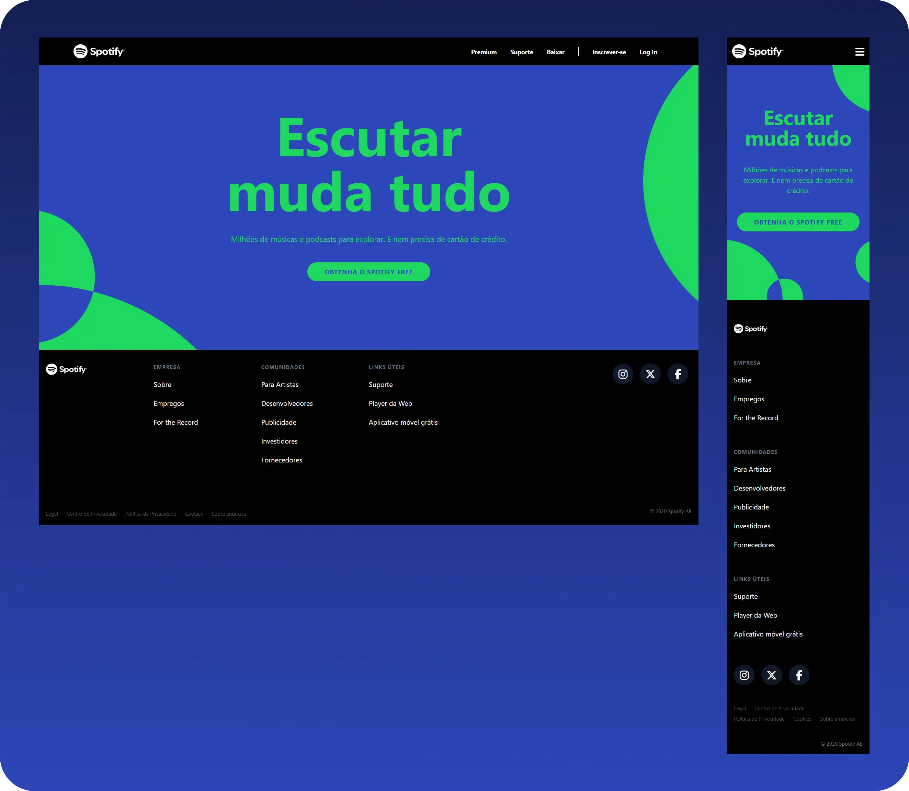

<div align="center">


</div>

<h1 align="center">Spotify Clone com Tailwind CSS</h1>

### 📝 Sobre
Este projeto foi desenvolvido no curso **Tailwind CSS do Básico ao Avançado + Projetos** da Comunidade Hora de Codar. O objetivo foi recriar a interface responsiva da Landing Page do Spotify, aplicando as funcionalidades mais recentes do **Tailwind CSS 4**.

---

### 🚀 UI e Deploy
<div align="center">
<p >
  
</p>

[→ Ver Projeto On-line 🔗](https://clone-lp-spotify-tailwind-css.vercel.app/)

</div>

---

## Como Configurar o Projeto no VS Code:

### 📌 Pré-requisitos
Antes de prosseguir com a configuração, certifique-se de ter todos os pré-requisitos instalados corretamente para evitar erros durante a instalação e execução do projeto.
```
Git 2.4+  |  Node.js 12+  |  VS Code  |  Live Server
```

### ⚙️ Configurando o Projeto

1. Clone este repositório:
Abra o **VS Code**, pressione `Ctrl + Shift + P`, digite **"Git Clone"** e cole o link do repositório:
```sh
https://github.com/domfabio/Clone-LP-Spotify-TailwindCSS.git
```
2. Instalar Dependências:
```sh
npm install
```
3. Inicie o servidor de desenvolvimento:
```sh
npm run dev
```
4. Rodar o Projeto
Usando a extensão **Live Server**:<br>
Clique com o botão direito no `index.html` e selecione **"Open with Live Server"**.

---

## 🤝 Contribuição
**Se deseja contribuir, siga os passos:**
1. Fork o repositório
2. Crie uma branch: `git checkout -b feature-minha-feature`
3. Faça commit das suas mudanças: `git commit -m 'Minha nova funcionalidade'`
4. Faça push para a branch: `git push origin feature-minha-feature`
5. Abra um Pull Request

---

## 📜 Licença
Este projeto é distribuído sob a licença MIT. Veja `LICENSE` para mais detalhes.

